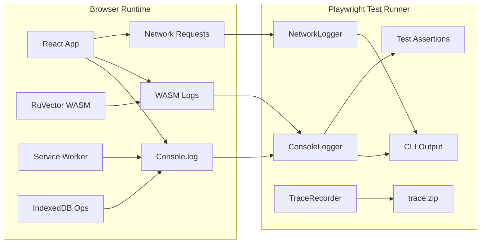
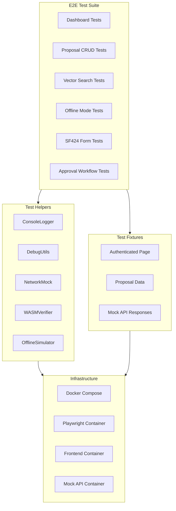

# ADR-010: End-to-End Testing with Browser Debugging

## Status
Accepted

## Date
2026-01-26

## Context

The HRS Grants Management frontend requires comprehensive end-to-end testing to ensure:
- Reliable user workflows across the 21 proposal states and 26 award states
- Proper initialization and operation of client-side WASM/vector operations (RuVector)
- Offline-first functionality with service worker validation
- Cross-browser compatibility with focus on enterprise Chromium deployments
- Debuggable test failures in both local development and CI/CD pipelines
- Browser console capture for diagnosing WASM initialization failures and vector operation errors

### Problem Statement

Traditional unit and integration tests cannot adequately validate:
1. **WASM Runtime Behavior**: RuVector's semantic search relies on WASM modules that behave differently in browser vs Node.js environments
2. **Service Worker Lifecycle**: Offline caching, background sync, and IndexedDB interactions require real browser execution
3. **Console Error Visibility**: WASM panics and vector operation failures often only appear in browser console logs
4. **Complex User Flows**: Multi-step proposal submissions, approval workflows, and SF424 form generation

## Decision

We will implement a comprehensive E2E testing strategy using **Playwright** as the primary testing framework, with custom browser console integration for debugging WASM and vector operations.

### Testing Framework: Playwright

Selected over alternatives based on:

| Criteria | Playwright | Cypress | Selenium |
|----------|-----------|---------|----------|
| Cross-browser | Chromium, Firefox, WebKit | Chromium-only (v10+) | All browsers |
| Async/await | Native | Chained commands | Promises |
| Console capture | Built-in | Plugin required | Manual setup |
| Docker support | Official images | Manual config | Selenium Grid |
| Trace viewer | Built-in | Dashboard only | External tools |
| Performance | Fast (parallel) | Sequential | Variable |
| Maintenance | Microsoft-backed | Cypress.io | Community |

### Browser Console Integration Architecture



### Test Architecture Overview



### Core Implementation Patterns

#### 1. Console Logger Utility

```typescript
// src/frontend/e2e/helpers/console-logger.ts

import { Page, ConsoleMessage } from '@playwright/test';

export interface LogEntry {
  timestamp: string;
  type: 'log' | 'warn' | 'error' | 'info' | 'debug';
  text: string;
  location?: string;
  args?: string[];
}

export class ConsoleLogger {
  private logs: LogEntry[] = [];
  private page: Page;
  private filter: (msg: ConsoleMessage) => boolean;

  constructor(page: Page, options?: { filter?: (msg: ConsoleMessage) => boolean }) {
    this.page = page;
    this.filter = options?.filter || (() => true);
    this.attach();
  }

  private attach(): void {
    this.page.on('console', async (msg) => {
      if (!this.filter(msg)) return;

      const entry: LogEntry = {
        timestamp: new Date().toISOString(),
        type: msg.type() as LogEntry['type'],
        text: msg.text(),
        location: msg.location()?.url,
      };

      // Capture arguments for complex objects
      try {
        const args = await Promise.all(
          msg.args().map(arg => arg.jsonValue().catch(() => '[unserializable]'))
        );
        entry.args = args.map(a => JSON.stringify(a));
      } catch {
        // Ignore serialization failures
      }

      this.logs.push(entry);
      this.printToConsole(entry);
    });

    // Capture page errors (uncaught exceptions)
    this.page.on('pageerror', (error) => {
      const entry: LogEntry = {
        timestamp: new Date().toISOString(),
        type: 'error',
        text: `PAGE ERROR: ${error.message}`,
      };
      this.logs.push(entry);
      this.printToConsole(entry);
    });
  }

  private printToConsole(entry: LogEntry): void {
    const prefix = {
      log: '    [LOG]',
      warn: '    [WARN]',
      error: '    [ERROR]',
      info: '    [INFO]',
      debug: '    [DEBUG]',
    }[entry.type];

    const color = {
      log: '\x1b[0m',      // default
      warn: '\x1b[33m',    // yellow
      error: '\x1b[31m',   // red
      info: '\x1b[36m',    // cyan
      debug: '\x1b[90m',   // gray
    }[entry.type];

    console.log(`${color}${prefix}\x1b[0m ${entry.text}`);
  }

  getLogs(): LogEntry[] {
    return [...this.logs];
  }

  getErrors(): LogEntry[] {
    return this.logs.filter(log => log.type === 'error');
  }

  getWarnings(): LogEntry[] {
    return this.logs.filter(log => log.type === 'warn');
  }

  findLogsContaining(text: string): LogEntry[] {
    return this.logs.filter(log =>
      log.text.toLowerCase().includes(text.toLowerCase())
    );
  }

  clear(): void {
    this.logs = [];
  }

  // Assertion helpers
  assertNoErrors(): void {
    const errors = this.getErrors();
    if (errors.length > 0) {
      throw new Error(
        `Expected no console errors, but found ${errors.length}:\n` +
        errors.map(e => `  - ${e.text}`).join('\n')
      );
    }
  }

  assertNoWASMPanics(): void {
    const panics = this.logs.filter(log =>
      log.text.includes('wasm') &&
      (log.text.includes('panic') || log.text.includes('unreachable'))
    );
    if (panics.length > 0) {
      throw new Error(
        `WASM panic detected:\n` +
        panics.map(e => `  - ${e.text}`).join('\n')
      );
    }
  }
}
```

#### 2. Debug Utilities

```typescript
// src/frontend/e2e/helpers/debug-utils.ts

import { Page, test } from '@playwright/test';

export interface DebugStepOptions {
  screenshot?: boolean;
  timeout?: number;
  trace?: boolean;
}

export async function debugStep(
  page: Page,
  name: string,
  action: () => Promise<void>,
  options: DebugStepOptions = {}
): Promise<void> {
  const startTime = Date.now();
  console.log(`\n=== DEBUG STEP: ${name} ===`);

  try {
    await test.step(name, async () => {
      if (options.timeout) {
        await Promise.race([
          action(),
          new Promise((_, reject) =>
            setTimeout(() => reject(new Error(`Step timeout: ${name}`)), options.timeout)
          )
        ]);
      } else {
        await action();
      }
    });

    const duration = Date.now() - startTime;
    console.log(`=== STEP COMPLETE: ${name} (${duration}ms) ===\n`);

    if (options.screenshot) {
      await page.screenshot({
        path: `test-results/debug-${name.replace(/\s+/g, '-')}-${Date.now()}.png`
      });
    }
  } catch (error) {
    console.error(`=== STEP FAILED: ${name} ===`);

    // Always screenshot on failure
    await page.screenshot({
      path: `test-results/failure-${name.replace(/\s+/g, '-')}-${Date.now()}.png`
    });

    throw error;
  }
}

export async function waitForWASMReady(page: Page, timeout = 30000): Promise<void> {
  console.log('  Waiting for WASM initialization...');

  await page.waitForFunction(
    () => {
      // Check for RuVector WASM module initialization
      return (window as any).__RUVECTOR_READY__ === true ||
             (window as any).ruvectorWasm?.initialized === true;
    },
    { timeout }
  );

  console.log('  WASM initialization complete');
}

export async function captureNetworkActivity(
  page: Page,
  action: () => Promise<void>
): Promise<{ requests: string[]; responses: string[] }> {
  const requests: string[] = [];
  const responses: string[] = [];

  const requestHandler = (request: any) => {
    requests.push(`${request.method()} ${request.url()}`);
  };

  const responseHandler = (response: any) => {
    responses.push(`${response.status()} ${response.url()}`);
  };

  page.on('request', requestHandler);
  page.on('response', responseHandler);

  await action();

  page.off('request', requestHandler);
  page.off('response', responseHandler);

  return { requests, responses };
}

export async function simulateOffline(page: Page): Promise<void> {
  await page.context().setOffline(true);
  console.log('  Network: OFFLINE');
}

export async function simulateOnline(page: Page): Promise<void> {
  await page.context().setOffline(false);
  console.log('  Network: ONLINE');
}

export async function dumpLocalStorage(page: Page): Promise<Record<string, string>> {
  return await page.evaluate(() => {
    const storage: Record<string, string> = {};
    for (let i = 0; i < localStorage.length; i++) {
      const key = localStorage.key(i);
      if (key) {
        storage[key] = localStorage.getItem(key) || '';
      }
    }
    return storage;
  });
}

export async function dumpIndexedDB(page: Page, dbName: string): Promise<any> {
  return await page.evaluate(async (name) => {
    return new Promise((resolve, reject) => {
      const request = indexedDB.open(name);
      request.onerror = () => reject(request.error);
      request.onsuccess = () => {
        const db = request.result;
        const info = {
          name: db.name,
          version: db.version,
          objectStoreNames: Array.from(db.objectStoreNames),
        };
        db.close();
        resolve(info);
      };
    });
  }, dbName);
}
```

#### 3. WASM Verification Helper

```typescript
// src/frontend/e2e/helpers/wasm-verifier.ts

import { Page, expect } from '@playwright/test';

export interface WASMStatus {
  loaded: boolean;
  initialized: boolean;
  version?: string;
  features?: string[];
  memoryUsage?: number;
}

export class WASMVerifier {
  private page: Page;

  constructor(page: Page) {
    this.page = page;
  }

  async getStatus(): Promise<WASMStatus> {
    return await this.page.evaluate(() => {
      const ruvector = (window as any).ruvectorWasm || (window as any).__RUVECTOR__;

      if (!ruvector) {
        return { loaded: false, initialized: false };
      }

      return {
        loaded: true,
        initialized: ruvector.initialized || ruvector.ready || false,
        version: ruvector.version,
        features: ruvector.features,
        memoryUsage: ruvector.memory?.buffer?.byteLength,
      };
    });
  }

  async waitForInitialization(timeout = 30000): Promise<WASMStatus> {
    const startTime = Date.now();

    while (Date.now() - startTime < timeout) {
      const status = await this.getStatus();

      if (status.initialized) {
        console.log(`  WASM initialized in ${Date.now() - startTime}ms`);
        console.log(`  Version: ${status.version || 'unknown'}`);
        console.log(`  Memory: ${status.memoryUsage ? (status.memoryUsage / 1024 / 1024).toFixed(2) + 'MB' : 'unknown'}`);
        return status;
      }

      await this.page.waitForTimeout(100);
    }

    throw new Error(`WASM initialization timeout after ${timeout}ms`);
  }

  async verifyVectorOperations(): Promise<void> {
    const result = await this.page.evaluate(async () => {
      const ruvector = (window as any).ruvectorWasm || (window as any).__RUVECTOR__;

      if (!ruvector || !ruvector.embed) {
        return { success: false, error: 'RuVector not available' };
      }

      try {
        // Test basic embedding generation
        const testText = 'test vector operation';
        const embedding = await ruvector.embed(testText);

        if (!embedding || !Array.isArray(embedding) || embedding.length === 0) {
          return { success: false, error: 'Invalid embedding result' };
        }

        return {
          success: true,
          dimensions: embedding.length,
          sampleValues: embedding.slice(0, 3)
        };
      } catch (error: any) {
        return { success: false, error: error.message };
      }
    });

    if (!result.success) {
      throw new Error(`Vector operation verification failed: ${result.error}`);
    }

    console.log(`  Vector operations verified (${result.dimensions} dimensions)`);
  }

  async verifySimilaritySearch(): Promise<void> {
    const result = await this.page.evaluate(async () => {
      const ruvector = (window as any).ruvectorWasm || (window as any).__RUVECTOR__;

      if (!ruvector || !ruvector.search) {
        return { success: false, error: 'Search not available' };
      }

      try {
        const results = await ruvector.search('test query', { limit: 5 });
        return {
          success: true,
          resultCount: results?.length || 0
        };
      } catch (error: any) {
        return { success: false, error: error.message };
      }
    });

    if (!result.success) {
      console.log(`  Similarity search: ${result.error} (may be expected if no data indexed)`);
    } else {
      console.log(`  Similarity search verified (${result.resultCount} results)`);
    }
  }
}
```

### Playwright Configuration

```typescript
// src/frontend/playwright.config.ts

import { defineConfig, devices } from '@playwright/test';

export default defineConfig({
  testDir: './e2e',
  fullyParallel: true,
  forbidOnly: !!process.env.CI,
  retries: process.env.CI ? 2 : 0,
  workers: process.env.CI ? 1 : undefined,
  reporter: [
    ['list'],
    ['html', { open: 'never' }],
    ['json', { outputFile: 'test-results/results.json' }],
  ],

  use: {
    baseURL: process.env.BASE_URL || 'http://localhost:3000',
    trace: 'on-first-retry',
    screenshot: 'only-on-failure',
    video: 'retain-on-failure',

    // Extended timeout for WASM initialization
    actionTimeout: 30000,
    navigationTimeout: 30000,
  },

  projects: [
    {
      name: 'chromium',
      use: {
        ...devices['Desktop Chrome'],
        launchOptions: {
          args: [
            '--enable-features=WebAssembly',
            '--enable-features=SharedArrayBuffer',
          ],
        },
      },
    },
    {
      name: 'firefox',
      use: { ...devices['Desktop Firefox'] },
    },
    {
      name: 'webkit',
      use: { ...devices['Desktop Safari'] },
    },
    // Mobile viewports
    {
      name: 'mobile-chrome',
      use: { ...devices['Pixel 5'] },
    },
  ],

  webServer: process.env.CI ? undefined : {
    command: 'npm run dev',
    url: 'http://localhost:3000',
    reuseExistingServer: !process.env.CI,
    timeout: 120000,
  },
});
```

### Test Fixtures

```typescript
// src/frontend/e2e/fixtures/fixtures.ts

import { test as base, expect } from '@playwright/test';
import { ConsoleLogger } from '../helpers/console-logger';
import { WASMVerifier } from '../helpers/wasm-verifier';

// Extend base test with custom fixtures
export const test = base.extend<{
  consoleLogger: ConsoleLogger;
  wasmVerifier: WASMVerifier;
  authenticatedPage: Page;
}>({
  consoleLogger: async ({ page }, use) => {
    const logger = new ConsoleLogger(page, {
      filter: (msg) => {
        // Filter out noisy logs
        const text = msg.text();
        return !text.includes('[HMR]') &&
               !text.includes('[vite]') &&
               !text.includes('Download the React DevTools');
      },
    });
    await use(logger);
  },

  wasmVerifier: async ({ page }, use) => {
    const verifier = new WASMVerifier(page);
    await use(verifier);
  },

  authenticatedPage: async ({ page }, use) => {
    // Set up authentication state
    await page.goto('/');

    // Mock authentication (adjust based on actual auth implementation)
    await page.evaluate(() => {
      localStorage.setItem('auth_token', 'test-token-e2e');
      localStorage.setItem('user', JSON.stringify({
        id: 'test-user-1',
        email: 'test@example.com',
        role: 'admin',
        tenantId: 'tenant-1',
      }));
    });

    await page.reload();
    await use(page);
  },
});

export { expect };
```

### Example Test Suites

#### Dashboard Tests

```typescript
// src/frontend/e2e/tests/dashboard.spec.ts

import { test, expect } from '../fixtures/fixtures';
import { debugStep, waitForWASMReady } from '../helpers/debug-utils';

test.describe('Dashboard', () => {
  test.beforeEach(async ({ page, consoleLogger }) => {
    console.log('\n--- Test Setup ---');
  });

  test.afterEach(async ({ consoleLogger }) => {
    console.log('\n--- Console Summary ---');
    const errors = consoleLogger.getErrors();
    if (errors.length > 0) {
      console.log(`Errors captured: ${errors.length}`);
      errors.forEach(e => console.log(`  - ${e.text}`));
    }
  });

  test('loads dashboard with WASM initialized', async ({
    authenticatedPage,
    consoleLogger,
    wasmVerifier
  }) => {
    await debugStep(authenticatedPage, 'Navigate to dashboard', async () => {
      await authenticatedPage.goto('/dashboard');
    });

    await debugStep(authenticatedPage, 'Wait for WASM', async () => {
      await wasmVerifier.waitForInitialization();
    });

    await debugStep(authenticatedPage, 'Verify page loaded', async () => {
      await expect(authenticatedPage.locator('[data-testid="dashboard-header"]'))
        .toBeVisible();
    });

    await debugStep(authenticatedPage, 'Verify no console errors', async () => {
      consoleLogger.assertNoErrors();
      consoleLogger.assertNoWASMPanics();
    });
  });

  test('displays proposal statistics', async ({ authenticatedPage }) => {
    await authenticatedPage.goto('/dashboard');

    await expect(authenticatedPage.locator('[data-testid="stat-total-proposals"]'))
      .toBeVisible();
    await expect(authenticatedPage.locator('[data-testid="stat-pending-approval"]'))
      .toBeVisible();
    await expect(authenticatedPage.locator('[data-testid="stat-active-awards"]'))
      .toBeVisible();
  });
});
```

#### Vector Search Tests

```typescript
// src/frontend/e2e/tests/vector-search.spec.ts

import { test, expect } from '../fixtures/fixtures';
import { debugStep } from '../helpers/debug-utils';

test.describe('Vector Search', () => {
  test('performs semantic search on proposals', async ({
    authenticatedPage,
    wasmVerifier,
    consoleLogger
  }) => {
    await authenticatedPage.goto('/proposals');

    await debugStep(authenticatedPage, 'Wait for WASM initialization', async () => {
      await wasmVerifier.waitForInitialization();
      await wasmVerifier.verifyVectorOperations();
    });

    await debugStep(authenticatedPage, 'Enter search query', async () => {
      await authenticatedPage.fill(
        '[data-testid="semantic-search-input"]',
        'climate change research funding'
      );
    });

    await debugStep(authenticatedPage, 'Submit search', async () => {
      await authenticatedPage.click('[data-testid="search-submit"]');
    });

    await debugStep(authenticatedPage, 'Verify results', async () => {
      // Wait for search results
      await authenticatedPage.waitForSelector('[data-testid="search-results"]');

      // Check console for search timing
      const searchLogs = consoleLogger.findLogsContaining('search');
      console.log(`  Search-related logs: ${searchLogs.length}`);

      // Verify at least one result
      const results = authenticatedPage.locator('[data-testid="search-result-item"]');
      const count = await results.count();
      console.log(`  Results found: ${count}`);

      expect(count).toBeGreaterThan(0);
    });

    // Verify no WASM panics during search
    consoleLogger.assertNoWASMPanics();
  });

  test('handles empty search results gracefully', async ({
    authenticatedPage,
    wasmVerifier
  }) => {
    await authenticatedPage.goto('/proposals');
    await wasmVerifier.waitForInitialization();

    await authenticatedPage.fill(
      '[data-testid="semantic-search-input"]',
      'xyznonexistentquery12345'
    );
    await authenticatedPage.click('[data-testid="search-submit"]');

    await expect(authenticatedPage.locator('[data-testid="no-results-message"]'))
      .toBeVisible();
  });
});
```

#### Offline Mode Tests

```typescript
// src/frontend/e2e/tests/offline.spec.ts

import { test, expect } from '../fixtures/fixtures';
import {
  debugStep,
  simulateOffline,
  simulateOnline,
  dumpLocalStorage,
  dumpIndexedDB
} from '../helpers/debug-utils';

test.describe('Offline Mode', () => {
  test('maintains functionality when offline', async ({
    authenticatedPage,
    consoleLogger
  }) => {
    // First, load page online to cache resources
    await debugStep(authenticatedPage, 'Initial page load (online)', async () => {
      await authenticatedPage.goto('/proposals');
      await authenticatedPage.waitForSelector('[data-testid="proposal-list"]');
    });

    // Go offline
    await debugStep(authenticatedPage, 'Simulate offline', async () => {
      await simulateOffline(authenticatedPage);
    });

    // Verify service worker takes over
    await debugStep(authenticatedPage, 'Reload page offline', async () => {
      await authenticatedPage.reload();

      // Should still see the page (served from cache)
      await expect(authenticatedPage.locator('[data-testid="proposal-list"]'))
        .toBeVisible({ timeout: 10000 });
    });

    // Verify offline indicator
    await debugStep(authenticatedPage, 'Verify offline indicator', async () => {
      await expect(authenticatedPage.locator('[data-testid="offline-indicator"]'))
        .toBeVisible();
    });

    // Test local operations
    await debugStep(authenticatedPage, 'Test local search (offline)', async () => {
      await authenticatedPage.fill('[data-testid="filter-input"]', 'test');
      // Should filter cached data
      await authenticatedPage.waitForTimeout(500);
    });

    // Debug: dump storage state
    console.log('\n  --- Storage State (Offline) ---');
    const localStorage = await dumpLocalStorage(authenticatedPage);
    console.log(`  LocalStorage keys: ${Object.keys(localStorage).length}`);

    try {
      const idbInfo = await dumpIndexedDB(authenticatedPage, 'grants-db');
      console.log(`  IndexedDB stores: ${idbInfo.objectStoreNames.join(', ')}`);
    } catch (e) {
      console.log('  IndexedDB: not available');
    }

    // Go back online
    await debugStep(authenticatedPage, 'Restore online', async () => {
      await simulateOnline(authenticatedPage);

      await expect(authenticatedPage.locator('[data-testid="offline-indicator"]'))
        .not.toBeVisible({ timeout: 5000 });
    });

    // Verify sync
    await debugStep(authenticatedPage, 'Verify sync indicator', async () => {
      // May show briefly during sync
      const syncIndicator = authenticatedPage.locator('[data-testid="sync-indicator"]');
      // Just check it doesn't error
      await authenticatedPage.waitForTimeout(1000);
    });
  });

  test('queues mutations when offline', async ({ authenticatedPage }) => {
    await authenticatedPage.goto('/proposals/new');
    await simulateOffline(authenticatedPage);

    // Fill form
    await authenticatedPage.fill('[data-testid="proposal-title"]', 'Offline Test Proposal');
    await authenticatedPage.fill('[data-testid="proposal-description"]', 'Created while offline');

    // Submit (should queue)
    await authenticatedPage.click('[data-testid="submit-proposal"]');

    // Should see queued indicator
    await expect(authenticatedPage.locator('[data-testid="queued-indicator"]'))
      .toBeVisible();

    // Go online and verify sync
    await simulateOnline(authenticatedPage);

    // Wait for sync
    await authenticatedPage.waitForSelector('[data-testid="sync-complete"]', {
      timeout: 10000,
    });
  });
});
```

#### Approval Workflow Tests

```typescript
// src/frontend/e2e/tests/approval-workflow.spec.ts

import { test, expect } from '../fixtures/fixtures';
import { debugStep } from '../helpers/debug-utils';

test.describe('Approval Workflow', () => {
  test('completes full approval workflow', async ({ authenticatedPage, consoleLogger }) => {
    // Navigate to pending approvals
    await debugStep(authenticatedPage, 'Navigate to approvals', async () => {
      await authenticatedPage.goto('/approvals');
      await authenticatedPage.waitForSelector('[data-testid="approval-list"]');
    });

    // Select first pending item
    await debugStep(authenticatedPage, 'Select pending item', async () => {
      await authenticatedPage.click('[data-testid="approval-item"]:first-child');
    });

    // Review details
    await debugStep(authenticatedPage, 'Review details modal', async () => {
      await expect(authenticatedPage.locator('[data-testid="approval-modal"]'))
        .toBeVisible();
      await expect(authenticatedPage.locator('[data-testid="proposal-details"]'))
        .toBeVisible();
    });

    // Add comment
    await debugStep(authenticatedPage, 'Add approval comment', async () => {
      await authenticatedPage.fill(
        '[data-testid="approval-comment"]',
        'Approved - meets all requirements'
      );
    });

    // Approve
    await debugStep(authenticatedPage, 'Click approve button', async () => {
      await authenticatedPage.click('[data-testid="approve-button"]');
    });

    // Verify state transition
    await debugStep(authenticatedPage, 'Verify state change', async () => {
      await expect(authenticatedPage.locator('[data-testid="approval-success"]'))
        .toBeVisible();

      // Check state in logs
      const stateLogs = consoleLogger.findLogsContaining('state');
      console.log(`  State transition logs: ${stateLogs.length}`);
    });

    consoleLogger.assertNoErrors();
  });

  test('handles rejection with required reason', async ({ authenticatedPage }) => {
    await authenticatedPage.goto('/approvals');
    await authenticatedPage.click('[data-testid="approval-item"]:first-child');

    // Try to reject without reason
    await authenticatedPage.click('[data-testid="reject-button"]');

    // Should show validation error
    await expect(authenticatedPage.locator('[data-testid="reason-required-error"]'))
      .toBeVisible();

    // Add reason
    await authenticatedPage.fill(
      '[data-testid="rejection-reason"]',
      'Missing required budget documentation'
    );

    // Now reject should work
    await authenticatedPage.click('[data-testid="reject-button"]');

    await expect(authenticatedPage.locator('[data-testid="rejection-success"]'))
      .toBeVisible();
  });
});
```

### Docker Integration

#### Docker Compose Configuration

```yaml
# docker-compose.test.yml

version: '3.8'

services:
  frontend:
    build:
      context: ./src/frontend
      dockerfile: Dockerfile
    ports:
      - "3000:3000"
    environment:
      - NODE_ENV=test
      - VITE_API_URL=http://mock-api:8080
    healthcheck:
      test: ["CMD", "curl", "-f", "http://localhost:3000"]
      interval: 10s
      timeout: 5s
      retries: 5
    networks:
      - test-network

  mock-api:
    build:
      context: ./test/mock-api
      dockerfile: Dockerfile
    ports:
      - "8080:8080"
    environment:
      - MOCK_DELAY_MS=50
    networks:
      - test-network

  playwright:
    build:
      context: ./src/frontend
      dockerfile: Dockerfile.playwright
    depends_on:
      frontend:
        condition: service_healthy
    environment:
      - BASE_URL=http://frontend:3000
      - CI=true
    volumes:
      - ./test-results:/app/test-results
      - ./playwright-report:/app/playwright-report
    networks:
      - test-network
    command: npx playwright test

networks:
  test-network:
    driver: bridge
```

#### Playwright Dockerfile

```dockerfile
# src/frontend/Dockerfile.playwright

FROM mcr.microsoft.com/playwright:v1.40.0-jammy

WORKDIR /app

# Install dependencies
COPY package*.json ./
RUN npm ci

# Copy test files
COPY e2e/ ./e2e/
COPY playwright.config.ts ./

# Create results directory
RUN mkdir -p test-results playwright-report

# Default command
CMD ["npx", "playwright", "test"]
```

### Shell Scripts

#### E2E Test Runner

```bash
#!/bin/bash
# scripts/test-e2e.sh

set -e

echo "=== E2E Test Suite ==="
echo ""

# Parse arguments
HEADED=""
DEBUG=""
BROWSER="chromium"
FILTER=""

while [[ $# -gt 0 ]]; do
  case $1 in
    --headed)
      HEADED="--headed"
      shift
      ;;
    --debug)
      DEBUG="--debug"
      shift
      ;;
    --browser)
      BROWSER="$2"
      shift 2
      ;;
    --filter)
      FILTER="$2"
      shift 2
      ;;
    *)
      shift
      ;;
  esac
done

# Clean previous results
rm -rf test-results playwright-report

# Check if running in Docker
if [ "$CI" = "true" ] || [ "$DOCKER" = "true" ]; then
  echo "Running in CI/Docker mode..."
  docker-compose -f docker-compose.test.yml up --build --abort-on-container-exit --exit-code-from playwright
  exit $?
fi

# Local development mode
echo "Running in local mode..."
echo "Browser: $BROWSER"
echo "Headed: ${HEADED:-false}"
echo ""

# Start frontend if not running
if ! curl -s http://localhost:3000 > /dev/null 2>&1; then
  echo "Starting frontend..."
  npm run dev &
  FRONTEND_PID=$!

  # Wait for frontend
  echo "Waiting for frontend..."
  npx wait-on http://localhost:3000 --timeout 60000
fi

# Run tests
PLAYWRIGHT_ARGS="--project=$BROWSER $HEADED $DEBUG"

if [ -n "$FILTER" ]; then
  PLAYWRIGHT_ARGS="$PLAYWRIGHT_ARGS --grep \"$FILTER\""
fi

echo "Running: npx playwright test $PLAYWRIGHT_ARGS"
npx playwright test $PLAYWRIGHT_ARGS

# Show report
if [ "$CI" != "true" ]; then
  npx playwright show-report
fi
```

#### Browser Debug Script

```bash
#!/bin/bash
# scripts/browser-debug.sh

set -e

echo "=== Browser Debug Mode ==="
echo ""
echo "This script runs E2E tests with full debugging output."
echo ""

# Enable verbose logging
export DEBUG=pw:api
export PWDEBUG=1

# Clean previous results
rm -rf test-results

# Create debug output directory
mkdir -p test-results/debug-logs

# Run with full tracing
npx playwright test \
  --headed \
  --trace on \
  --video on \
  --screenshot on \
  --reporter=list \
  "$@" 2>&1 | tee test-results/debug-logs/test-output.log

echo ""
echo "=== Debug artifacts saved to test-results/ ==="
echo ""
echo "Files:"
ls -la test-results/

echo ""
echo "To view trace: npx playwright show-trace test-results/*/trace.zip"
echo "To view report: npx playwright show-report"
```

### CI/CD Integration

#### GitHub Actions Workflow

```yaml
# .github/workflows/e2e-tests.yml

name: E2E Tests

on:
  push:
    branches: [main, develop]
  pull_request:
    branches: [main]

jobs:
  e2e:
    runs-on: ubuntu-latest
    timeout-minutes: 30

    steps:
      - uses: actions/checkout@v4

      - name: Setup Node.js
        uses: actions/setup-node@v4
        with:
          node-version: '20'
          cache: 'npm'
          cache-dependency-path: src/frontend/package-lock.json

      - name: Install dependencies
        working-directory: src/frontend
        run: npm ci

      - name: Install Playwright browsers
        working-directory: src/frontend
        run: npx playwright install --with-deps chromium

      - name: Build frontend
        working-directory: src/frontend
        run: npm run build

      - name: Run E2E tests
        working-directory: src/frontend
        run: npx playwright test --project=chromium
        env:
          CI: true

      - name: Upload test results
        if: always()
        uses: actions/upload-artifact@v4
        with:
          name: playwright-report
          path: src/frontend/playwright-report/
          retention-days: 7

      - name: Upload traces on failure
        if: failure()
        uses: actions/upload-artifact@v4
        with:
          name: playwright-traces
          path: src/frontend/test-results/
          retention-days: 7
```

### Test Data Selectors Reference

All UI components must include `data-testid` attributes for reliable E2E testing:

| Component | Selector | Description |
|-----------|----------|-------------|
| Dashboard header | `data-testid="dashboard-header"` | Main dashboard title |
| Total proposals | `data-testid="stat-total-proposals"` | Statistics card |
| Pending approvals | `data-testid="stat-pending-approval"` | Statistics card |
| Active awards | `data-testid="stat-active-awards"` | Statistics card |
| Semantic search | `data-testid="semantic-search-input"` | Vector search input |
| Search submit | `data-testid="search-submit"` | Search button |
| Search results | `data-testid="search-results"` | Results container |
| Search result item | `data-testid="search-result-item"` | Individual result |
| Proposal list | `data-testid="proposal-list"` | Proposals table/list |
| Proposal title | `data-testid="proposal-title"` | Title input field |
| Offline indicator | `data-testid="offline-indicator"` | Offline status badge |
| Sync indicator | `data-testid="sync-indicator"` | Sync in progress |
| Approval list | `data-testid="approval-list"` | Pending approvals |
| Approval item | `data-testid="approval-item"` | Individual approval |
| Approve button | `data-testid="approve-button"` | Approval action |
| Reject button | `data-testid="reject-button"` | Rejection action |

## Rationale

1. **Playwright Selection**: Modern, fast, and Microsoft-backed with excellent TypeScript support and built-in trace viewer
2. **Console Capture**: Essential for debugging WASM issues that only manifest in browser console
3. **Debug Steps**: Labeled sections provide clear test progression in CI logs
4. **Docker Integration**: Ensures consistent test environment across local and CI
5. **Offline Testing**: Validates service worker and IndexedDB functionality critical for field use

## Consequences

### Positive
- Comprehensive validation of user workflows including all 21 proposal states
- WASM initialization issues caught early in CI pipeline
- Browser console logs visible in test output for debugging
- Offline functionality verified automatically
- Trace files enable post-mortem debugging of CI failures
- Cross-browser compatibility validated
- Screenshot and video evidence on test failures

### Negative
- Additional Docker build time (~2-3 minutes for Playwright image)
- Playwright browser download (~200MB for Chromium)
- Tests run slower than unit tests (30s-2min typical)
- Requires maintaining data-testid attributes in components
- Flakiness possible with timing-sensitive tests

### Mitigation Strategies
- Cache Playwright browsers in CI
- Use `test.slow()` for known slow tests
- Implement retry logic for flaky tests
- Run E2E as separate CI stage (after unit tests pass)

## Implementation Checklist

- [ ] Create `src/frontend/e2e/` directory structure
- [ ] Implement `ConsoleLogger` helper
- [ ] Implement `DebugUtils` helpers
- [ ] Implement `WASMVerifier` helper
- [ ] Configure `playwright.config.ts`
- [ ] Create test fixtures with authentication
- [ ] Write dashboard test suite
- [ ] Write vector search test suite
- [ ] Write offline mode test suite
- [ ] Write approval workflow test suite
- [ ] Create `Dockerfile.playwright`
- [ ] Create `docker-compose.test.yml`
- [ ] Create `scripts/test-e2e.sh`
- [ ] Create `scripts/browser-debug.sh`
- [ ] Add GitHub Actions workflow
- [ ] Document data-testid conventions
- [ ] Add data-testid attributes to all components

## References

- [Playwright Documentation](https://playwright.dev/docs/intro)
- [Playwright Docker Images](https://playwright.dev/docs/docker)
- [Playwright Trace Viewer](https://playwright.dev/docs/trace-viewer)
- [WASM Debugging in Browsers](https://developer.chrome.com/docs/devtools/wasm/)
- [Service Worker Testing Strategies](https://web.dev/articles/service-worker-lifecycle)
- ADR-001: Clean Architecture with Domain-Driven Design
- ADR-008: RuVector Integration
- HRS Grants Module Requirements Specifications v1.1
