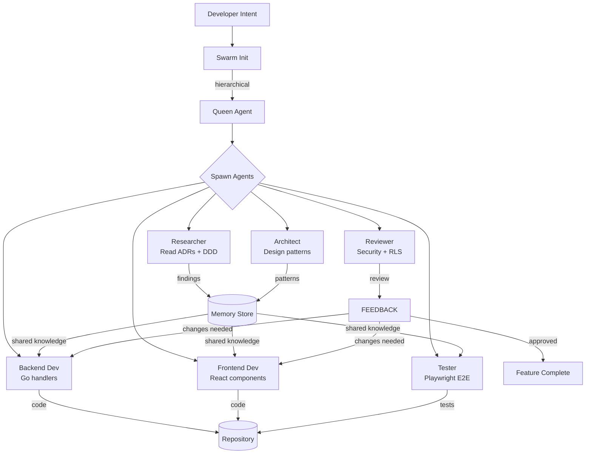
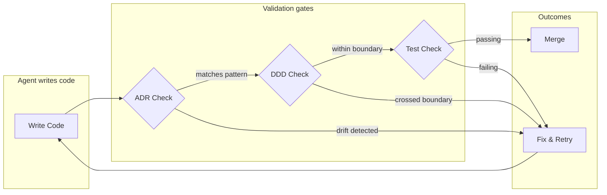
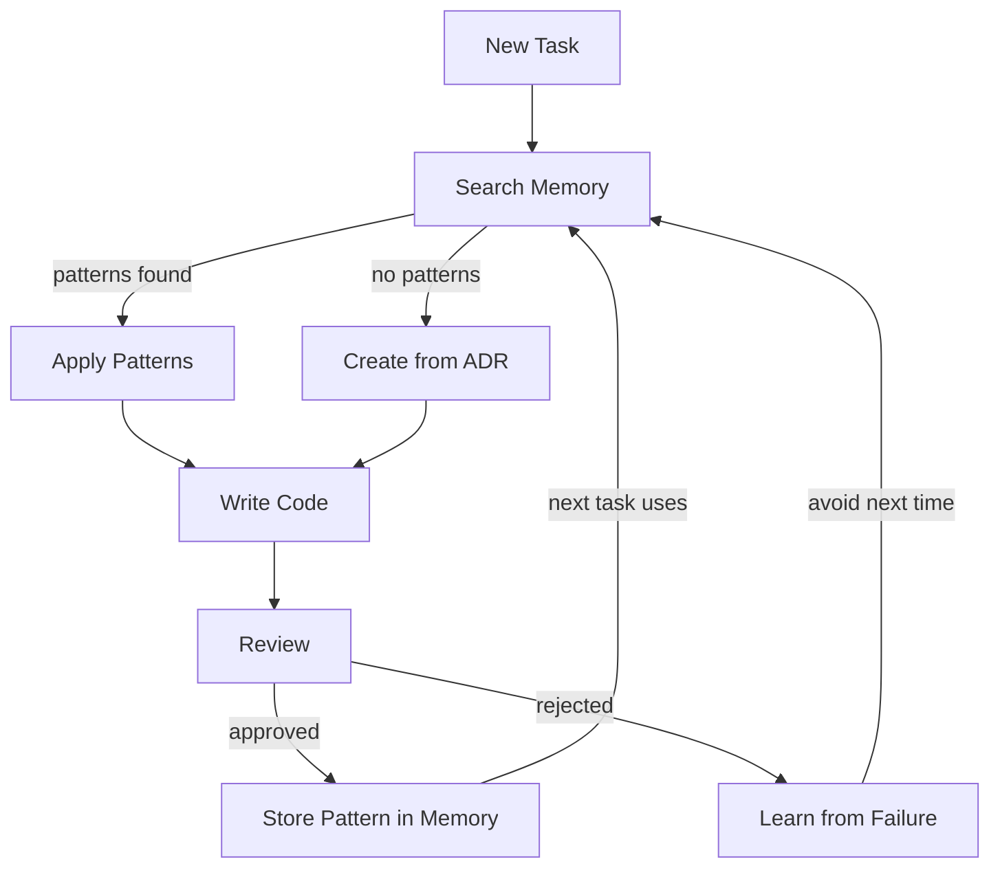

# Agent Flow Diagrams

## Swarm Execution Flow

```mermaid
graph TD
    START[Developer Intent] --> INIT[Swarm Init]
    INIT --> |hierarchical| QUEEN[Queen Agent]

    QUEEN --> SPAWN{Spawn Agents}

    SPAWN --> R[Researcher<br/>Read ADRs + DDD]
    SPAWN --> A[Architect<br/>Design patterns]
    SPAWN --> B[Backend Dev<br/>Go handlers]
    SPAWN --> F[Frontend Dev<br/>React components]
    SPAWN --> T[Tester<br/>Playwright E2E]
    SPAWN --> RV[Reviewer<br/>Security + RLS]

    R --> |findings| MEM[(Memory Store)]
    A --> |patterns| MEM
    B --> |code| REPO[(Repository)]
    F --> |code| REPO
    T --> |tests| REPO
    RV --> |review| FEEDBACK

    MEM --> |shared knowledge| B & F & T

    FEEDBACK --> |approved| DONE[Feature Complete]
    FEEDBACK --> |changes needed| B & F
```

## Anti-Drift Flow

```mermaid
graph LR
    subgraph "Agent writes code"
        WRITE[Write Code]
    end

    subgraph "Validation gates"
        ADR{ADR Check}
        DDD{DDD Check}
        TEST{Test Check}
    end

    subgraph "Outcomes"
        PASS[Merge]
        FIX[Fix & Retry]
    end

    WRITE --> ADR
    ADR --> |matches pattern| DDD
    ADR --> |drift detected| FIX
    DDD --> |within boundary| TEST
    DDD --> |crossed boundary| FIX
    TEST --> |passing| PASS
    TEST --> |failing| FIX
    FIX --> WRITE
```

## Memory Feedback Loop

```mermaid
graph TD
    TASK[New Task] --> SEARCH[Search Memory]
    SEARCH --> |patterns found| APPLY[Apply Patterns]
    SEARCH --> |no patterns| CREATE[Create from ADR]

    APPLY --> CODE[Write Code]
    CREATE --> CODE

    CODE --> REVIEW[Review]
    REVIEW --> |approved| STORE[Store Pattern in Memory]
    REVIEW --> |rejected| LEARN[Learn from Failure]

    STORE --> |next task uses| SEARCH
    LEARN --> |avoid next time| SEARCH
```
