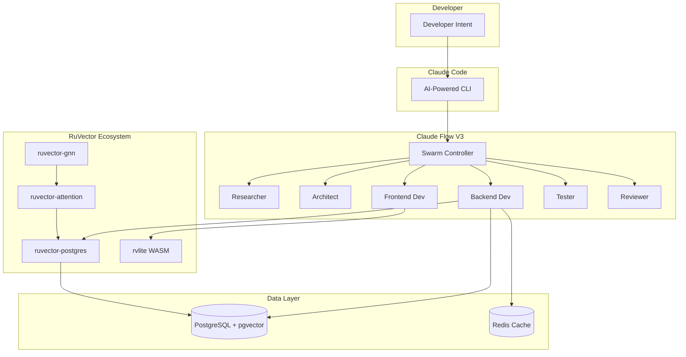

# Architecture Diagrams

## 1. System Architecture (Slide 02)

## 2. Clean Architecture Rings (Slide 11)

## 3. Request Flow (Slide 15)

## 4. Self-Learning Loop (Slide 16)

## 5. Swarm Topology (Slide 17)

