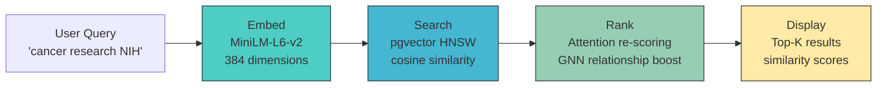
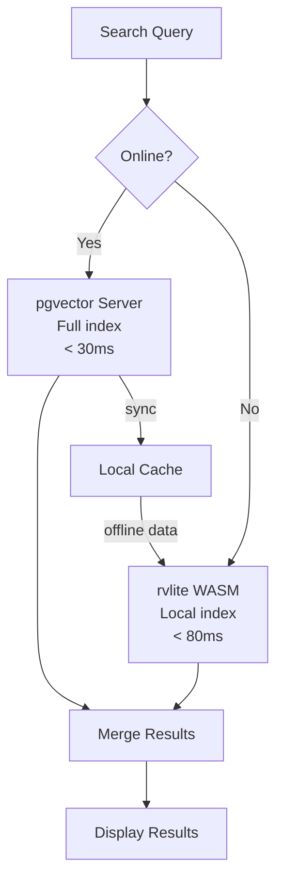
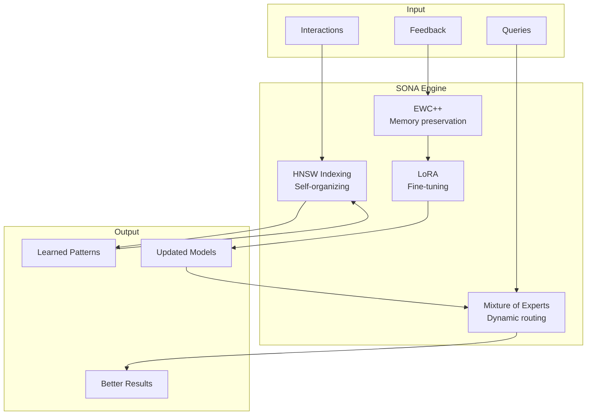
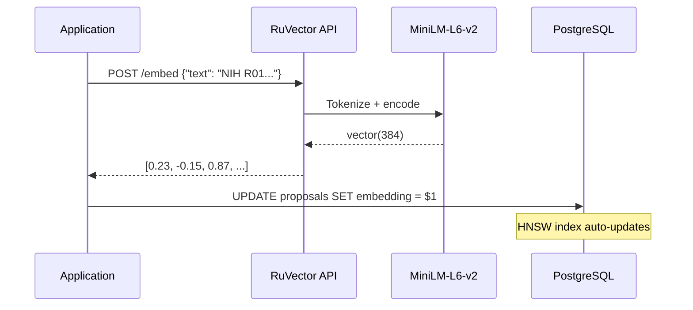

# RuVector Pipeline Diagrams

## Vector Search Pipeline

```mermaid
graph LR
    Q[User Query<br/>'cancer research NIH'] --> E[Embed<br/>MiniLM-L6-v2<br/>384 dimensions]
    E --> S[Search<br/>pgvector HNSW<br/>cosine similarity]
    S --> R[Rank<br/>Attention re-scoring<br/>GNN relationship boost]
    R --> D[Display<br/>Top-K results<br/>similarity scores]

    style E fill:#4ecdc4,stroke:#333
    style S fill:#45b7d1,stroke:#333
    style R fill:#96ceb4,stroke:#333
    style D fill:#ffeaa7,stroke:#333
```

## Online/Offline Strategy

```mermaid
graph TD
    Q[Search Query] --> CHECK{Online?}

    CHECK --> |Yes| SERVER[pgvector Server<br/>Full index<br/>< 30ms]
    CHECK --> |No| WASM[rvlite WASM<br/>Local index<br/>< 80ms]

    SERVER --> MERGE[Merge Results]
    WASM --> MERGE

    MERGE --> DISPLAY[Display Results]

    SERVER --> |sync| CACHE[Local Cache]
    CACHE --> |offline data| WASM
```

## SONA Self-Learning Engine

```mermaid
graph TB
    subgraph "SONA Engine"
        MOE[Mixture of Experts<br/>Dynamic routing]
        HNSW[HNSW Indexing<br/>Self-organizing]
        EWC[EWC++<br/>Memory preservation]
        LORA[LoRA<br/>Fine-tuning]
    end

    subgraph "Input"
        Q[Queries]
        I[Interactions]
        F[Feedback]
    end

    subgraph "Output"
        R[Better Results]
        P[Learned Patterns]
        M[Updated Models]
    end

    Q --> MOE
    I --> HNSW
    F --> EWC

    MOE --> R
    HNSW --> P
    EWC --> LORA
    LORA --> M

    M --> MOE
    P --> HNSW
```

## Embedding Generation

```mermaid
sequenceDiagram
    participant App as Application
    participant RV as RuVector API
    participant Model as MiniLM-L6-v2
    participant PG as PostgreSQL

    App->>RV: POST /embed {"text": "NIH R01..."}
    RV->>Model: Tokenize + encode
    Model-->>RV: vector(384)
    RV-->>App: [0.23, -0.15, 0.87, ...]
    App->>PG: UPDATE proposals SET embedding = $1

    Note over PG: HNSW index auto-updates
```
